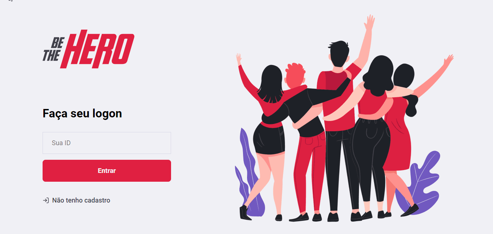
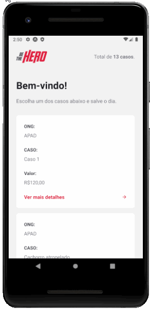

<h1 align="center">
  
</h1>

<p align="center">
  
  
</p>

<p align="center">
  
</p>

<p align="center">
  
</p>

## :memo: Projeto

Essa aplicação permite a doação de pessoas para ong's que precisam de ajuda.

## :rocket: Tecnologias

- [Node.js](https://nodejs.org/en/)
- [React](https://reactjs.org)
- [React Native](https://facebook.github.io/react-native/)
- [Expo](https://expo.io/)

## :gear: Rodando o projeto
``` bash
  $git clone https://github.com/frapimoneto/Be-The-Hero
  $cd Be-The-Hero
  $cd backend
  $yarn
  $yarn start
  $cd frontend
  $yarn
  $yarn start
  $cd mobile
  $yarn
  $yarn start
```

Feito com ❤ por Francisco Pinto Moreira Neto 😃 [Get in touch!](https://github.com/frapimoneto)